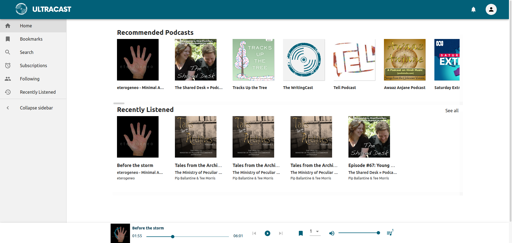

# capSquad Presents: ultraCast


## Preview


## Overview
For the full report on this project, please see this [PDF](https://raw.githubusercontent.com/Kevinwochan/Ultracast/main/docs/report/report.pdf)

## Running on CSE


Running Ultracast from CSE is simple. Simply run: 

```
./start.sh
```

The script `start.sh` will:

    * Create a python venv for the backend
    * Install all required python packages in the venv
    * Install all npm packages that are required for the frontend
    * Launch the backend webserver
    * Launch the frontend
    * Open ultracast in your browser (may not work on vlab)

Once the setup is completed and UltraCast is launched you will see a message like:

```
Serving frontend at http://localhost:43689/
```

To avoid failing to launch because a port is already in use, the port which is used is decided at runtime.
You can then navigate in a webbrowser to the link printed to the terminal to use UltraCast

## Advanced Usage

### Local Backend Instance

You can configure the frontend at runtime to use a local backend webserver for GraphQL queries instead of the remote webserver.
**It is highly recommended not to run UltraCast in local mode on UNSW CSE machines as the port used for the GraphQL endpoint is often already in use**

To do this:

```
./start.sh --local
```

### Alternative Backend Run Methods

There are two scripts which can be used to run the site's backend:

    * `backend/start.sh` runs the backend in a development environment (debugging enable and with a development WSGI webserver)
    * `backend/start_production.sh` runs the backend in a production environment
        * Production WSGI webserver with multiple worker processes
        * Disable debugging prints etc.

## Configuration

### Backend

The backend is configured by using python files which set various configuration variables.
These include options including:

    * The IP address of the MonogDB instance
    * The MonogDB database
    * Flask secret keys (for encryption)
    * Algolia API key and user

Any variables that are not set are defaulted to the value in `backend/config/default_settings.py`.
You can override these settings by writing a new python file and setting the environment variable `ULTRACAST_BACKEND_SETTINGS` to be the real path of this file.
For example if the settings file is at `~/ultracast_settings.py`, you could do:

```
export ULTRACAST_BACKEND_SETTINGS=$(realpath ~/ultracast_settings.py)
bash backend/start.sh
```

### Frontend

The frontend can be configured by editing the file `frontend/src/api/config.js`
Here you can set options including:

    * The backend GraphQL endpoint to use
    * Algolia API key and user

<!---

## Credentials:
### algolia
Username: oli.richards.junk1@gmail.com
Password: i9V5pSmHMzf7S2g
-->
